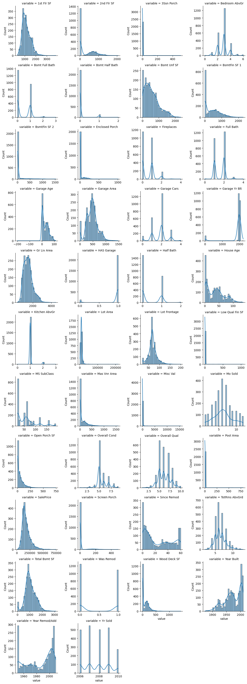
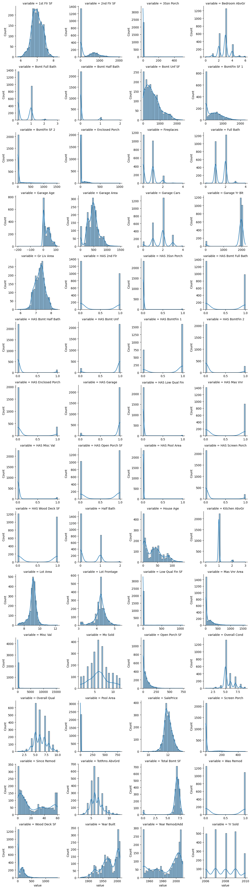

# 🏡 Ames Housing Price Predictor

This project builds a regression model to **predict housing prices** using the Ames Housing dataset. It includes:

- Data preprocessing
- Feature engineering
- Model training with XGBoost
- Evaluation with RMSE and R²
- A Streamlit web app for real-time predictions

---

## 📊 Data Overview

- **Dataset**: Ames Housing Dataset ([Link to Kaggle Dataset](https://www.kaggle.com/datasets/prevek18/ames-housing-dataset))
- **Rows**: ~2,900
- **Target**: `SalePrice` (log-transformed for modeling)
- **Features**: 80+ features including lot size, year built, number of bathrooms, and more

---

## ⚙️ Preprocessing

- Handled missing values
- Encoded categorical features (One-Hot and binary flags)
- Log-transformed skewed features
- Optimized types & memory usage

### Histograms (Before vs After)

| Before | After |
|--------|-------|
|  |  |

---

## Model

### Algorithm

**XGBoost Regressor**, manually tuned with early stopping.

```python
XGBRegressor(
    n_estimators=500,
    max_depth=6,
    learning_rate=0.03,
    reg_alpha=0.1,
    reg_lambda=1.0,
    random_state=42
)
```
---

## 📈 Results

| Metric   | Train   | Test    |
|----------|---------|---------|
| RMSE     | 0.0667  | 0.1291  |
| R² Score | 0.9734  | 0.8969  |

✅ Model generalizes well with minimal overfitting.

---

## 📌 Top 20 Influential Features

| Feature             | Score |
|---------------------|-------|
| Garage Finish_Unf   | 0.396 |
| Garage Cars         | 0.100 |
| Fireplaces          | 0.073 |
| Overall Qual        | 0.052 |
| Gr Liv Area         | 0.031 |
| MS Zoning_RL        | 0.030 |
| Total Bsmt SF       | 0.027 |
| Paved Drive_Y       | 0.023 |
| Central Air_Y       | 0.021 |
| Year Remod/Add      | 0.016 |
| House Age           | 0.012 |
| Year Built          | 0.012 |
| MS Zoning_RM        | 0.007 |
| Garage Area         | 0.007 |
| BsmtFin SF 1        | 0.006 |
| Bsmt Exposure_Gd    | 0.006 |
| Since Remod         | 0.005 |
| Exter Cond_Po       | 0.005 |
| Kitchen AbvGr       | 0.004 |
| Garage Yr Blt       | 0.004 |

---

## 🚀 Streamlit App

Run it locally:

```bash
streamlit run app.py
```
Fill out a home’s details and get an instant price prediction.

---

## Installation

```bash
pip install -r requirements.txt
```
Recommended: Python 3.10+

---

## 🧠 Key Takeaways

- Log-transforming SalePrice improves performance
- Early preprocessing avoids downstream bugs
- Monitoring both RMSE and R² is key to model evaluation
- A complete ML + UI setup makes this project portfolio-ready

---

## 📘 License

This project is open-source and available under the [MIT License](LICENSE).
